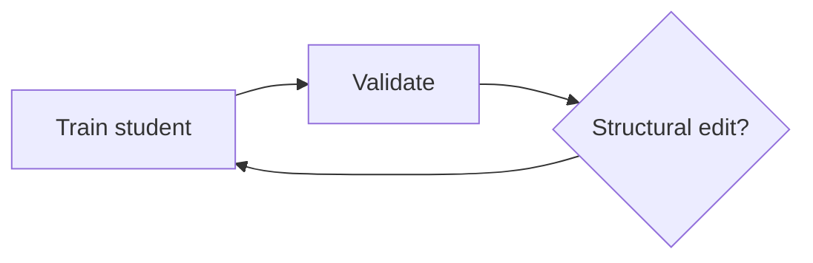
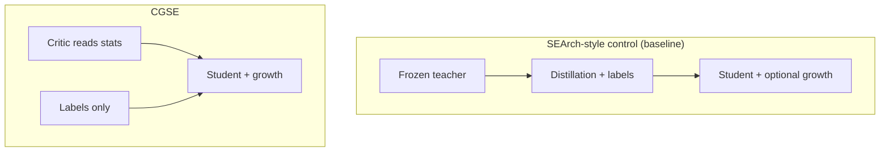
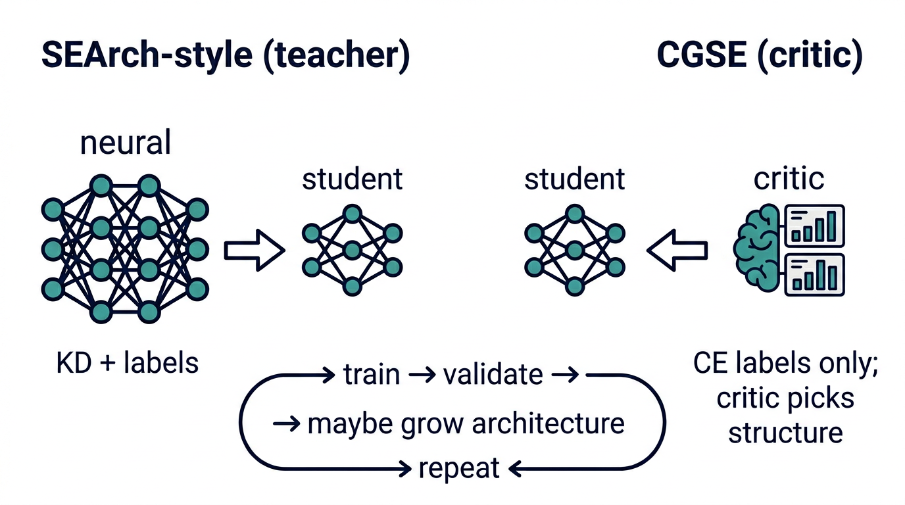
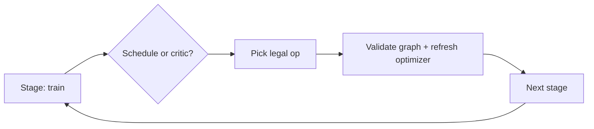
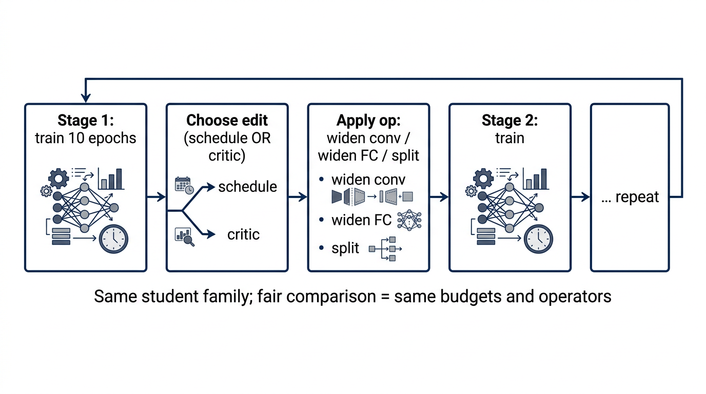

# CGSE — research code for structurally mutable neural networks

**CGSE** (*Critic-Guided Self-Evolution*) is a research codebase for training **student networks whose architecture can change during optimization**—for example, widening fully connected layers or inserting depth—while keeping training numerically stable through **graph validation** and **optimizer state handling**.

> **Primary goal.** Build a **reproducible lab** where neural nets for **CIFAR-10** can **grow during training** (wider layers, deeper blocks, wider convolutions), and we can **fairly compare** *who chooses those edits*: a **fixed schedule**, a **teacher** (SEArch-style knowledge distillation), or a **critic** that reads **training statistics** instead of a teacher (**CGSE**). Same operators and budgets → the variable is **structural guidance**.

---

## Start here (plain language)

**If you are new here:** we are **not** only tuning numbers inside a fixed network. We sometimes **change the network’s shape** after a chunk of training, then keep training. Think of repeated **terms**: train for a while → check a **report card** (loss and accuracy on a validation set) → optionally **remodel** (add width or depth in a controlled way) → repeat.

**Why it matters:** fixed-capacity models can leave accuracy on the table; **structural evolution** adds capacity **when** the protocol says so, under rules that keep experiments comparable.

**SEArch** (prior work we cite) does something similar but uses a **larger teacher** to guide growth. **This repo still runs teacher baselines** (frozen teacher + knowledge distillation + optional mutations). **CGSE** is the question: can we **drop the teacher for structural decisions** and use a **small critic** that reads **internal training signals** (losses, accuracies, epoch progress, parameter count, …), while **labels** still teach classification through ordinary cross-entropy?



**The main contrast** is *who picks the edit* when several are allowed:



| In words | Teacher arm | CGSE arm |
|----------|-------------|----------|
| Extra signal beyond labels | Teacher logits (KD) | None |
| Who drives structural choices | Schedule / teacher setup | **Critic** on internal stats |
| Classification loss | CE + KD | **CE** (critic does not replace logits) |



**Tier 1b** is the **multi-stage** version of the same idea: each **stage** runs several epochs; at stage boundaries you may apply one of a **small set of edits** (e.g. widen a conv, widen a classifier layer, insert a depth block). Use a **YAML schedule** for a deterministic baseline, or the **critic** to sample among **legal** operations.





**Dig deeper:** configs in `configs/`, run artifacts in [`runs/README.md`](runs/README.md), figures in [`paper_documentation/figures/`](paper_documentation/figures/), narrative PDFs and logs in [`paper_documentation/README.md`](paper_documentation/README.md).

---

### Experimental design (teacher baseline vs CGSE)

We isolate **one** contrast:

| Arm | Non-label guidance | Structural edits |
|-----|--------------------|------------------|
| **SEArch-style control (teacher)** | A **frozen teacher** provides **knowledge distillation** while the student trains. The student may also undergo **scheduled mutations** (e.g. widen). This is the **external-guidance baseline**. |
| **CGSE** | **No teacher.** A **structural critic** (trained on **internal** optimization statistics) **replaces** the teacher for **when/where to mutate**. **Label cross-entropy** still trains the student for classification; the critic does **not** replace class logits. |

Broader brainstorming from early drafts (multi-objective arbitration, predictive architecture selection, staged teacher–critic hybrids, etc.) is **out of scope** for this repository—we only implement toward **teacher control → critic replaces teacher**.

**Primary competitor / baseline system.** The self-evolving pipeline we are answering is **SEArch** (Liang, Xiang & Li, *Neurocomputing* 2025): a **teacher-guided** student that grows by **bottleneck scoring** and **edge splitting** on CIFAR-10/100 and ImageNet. **CGSE is the same *kind* of iterative structural search**, but the **critic replaces the teacher** for *where/when* to edit the graph; see **`paper_documentation/project-doc.pdf`** for the full CGSE framing. A **citation, gap analysis, experiment tiers, and test checklist** are in **[`paper_documentation/SEArch-baseline-and-CGSE-evaluation-plan.md`](paper_documentation/SEArch-baseline-and-CGSE-evaluation-plan.md)** (local PDF: `paper_documentation/SEArch (MP-1 Base Paper) (1).pdf`).

**Tier 1b (multi-stage, multi-operator evolution)** is specified in **§7** of that document and **implemented** in `train.py` via **`evolution.enabled`** (modes **`schedule`** and **`critic`**). Full CIFAR configs: **`configs/evolution/evolution_tier1b_schedule.yaml`**, **`configs/evolution/evolution_tier1b_critic.yaml`**; smoke: **`configs/evolution/smoke/evolution_tier1b_smoke.yaml`**, **`configs/evolution/smoke/evolution_tier1b_critic_smoke.yaml`**. Sweep: **`scripts/run_tier1b.sh`** (see [`runs/README.md`](runs/README.md)). A long Tier 1 job and new Tier 1b runs can coexist on different branches or processes—see [`runs/README.md`](runs/README.md#tier-1-vs-tier-1b-development-in-parallel).

**In code now (Tier 1):** mutations, CIFAR, logging, **`teacher` + KD** in `train.py`, configs **`configs/cifar/phase3_cifar_kd.yaml`** and **`configs/cifar/baseline_sear_ch_teacher_mutate.yaml`**. **CGSE (single widen):** **`critic.enabled: true`** — **`StructuralCritic`** gates **`edge_widen`** in an epoch window (ε-greedy); **REINFORCE** on post-mutation Δval. Configs **`configs/cifar/phase2_cifar_full_cgse.yaml`**, **`configs/cifar/smoke/phase2_cifar_cgse_smoke.yaml`**. **`critics/state_features.py`** (8-D state); metrics CSV optional **`critic_score`**.

Background materials: `paper_documentation/`. Step-by-step implementation story: **[detailed phase walkthrough](paper_documentation/CGSE-detailed-phase-walkthrough.md)**.

---

## Motivation (engineering)

Standard deep learning fixes a model’s structure before training. **Structural evolution** instead adjusts width or depth **during** training so capacity can grow where it helps. Doing this safely requires:

- An explicit **computational graph** (not an opaque blob of layers) so edits have a well-defined target.
- **Mutation operators** that preserve behavior approximately when possible (e.g. Net2Net-style widening with weight copying).
- **Re-validation** after each edit (shapes, forward pass).
- **Optimizer refresh** when new parameters appear, so momentum and variance estimates are not applied to stale tensors.

CGSE implements that substrate in PyTorch and connects it to a **real vision benchmark** (CIFAR-10) so results are meaningful, not only toy demonstrations.

---

## What is implemented in this repository

| Area | Status | Description |
|------|--------|-------------|
| **Mutable graph student** | Active | `GraphModule`: ordered nodes (`nn.ModuleDict` + execution list), sequential forward. |
| **Structural operators** | Active | `edge_widen` (widen a `Linear`, fix downstream linears); `edge_split` (identity-style deepen). |
| **Safety & training integration** | Active | Forward validation, `refresh_optimizer` after mutations. |
| **CIFAR-10 training** | Active | `CifarGraphNet` (small CNN as a graph); train/test metrics; YAML configs. |
| **Experiment logging** | Active | Per-epoch CSV (`training.log_csv`); optional JSONL per mutation event (`mutation.log_jsonl`). |
| **In-loop mutation (Phase 2)** | Active | Config-driven: e.g. widen once after a chosen epoch, then continue training. |
| **Frozen teacher + KD (SEArch-style control)** | Active | **`teacher`** in YAML: CE + KD vs a saved **`CifarGraphNet`** (e.g. **`configs/cifar/phase3_cifar_kd.yaml`**). |
| **Teacher + KD + mutate (full control baseline)** | Active | **`configs/cifar/baseline_sear_ch_teacher_mutate.yaml`** — same mutation schedule as Phase 2 mutate, plus teacher. |
| **CGSE critic (replaces teacher)** | Active | **`critic:`** YAML + **`train.py`** windowed gating, REINFORCE on post-mutation Δval; **`critics/state_features.py`** (8-D stats). |
| **Tier 1b (multi-stage, multi-op)** | Active | **`evolution:`** in YAML; **`training/evolution_train.py`**; ops in **`utils/evolution_apply.py`**, **`ops/edge_widen_conv.py`**. Spec: **[evaluation plan §7](paper_documentation/SEArch-baseline-and-CGSE-evaluation-plan.md)**. |
| **Pytest suite** | Minimal | Demos and stress scripts under `scripts/`; `tests/` reserved for automated tests. |

See **[Phase status](paper_documentation/CGSE-implementation-log.md#3-phase-status)** in the implementation log for a compact roadmap table.

---

## Repository layout

```
cgse/
├── README.md                 ← This file
├── requirements.txt
├── train.py                  # Main entry: load YAML, train, optional mutation, checkpoint
├── configs/
│   ├── cifar/                # CIFAR-10 (`smoke/` = quick runs; rest = full recipes)
│   ├── evolution/            # Tier 1b (`smoke/` = short dev runs)
│   └── synthetic/            # `base.yaml` — random-data MLP
├── models/                   # GraphModule, MLP student, CIFAR CNN student
├── ops/                      # edge_widen, edge_split
├── training/                 # CIFAR loaders, train/eval loop, synthetic data
├── utils/                    # seeds, checkpoint, validators, mutation logging, optimizer refresh
├── scripts/                  # `run_tier1.sh`, `run_tier1b.sh`; mutation / robustness demos
├── critics/                  # StructuralCritic (CGSE; replaces teacher for mutation decisions)
├── paper_documentation/      # Paper PDFs, implementation log, codebase guide, figures (see below)
├── runs/                     # `tier1|tier1b|smoke/other` × `metrics|logs|mutations/` (see runs/README.md)
├── checkpoints/              # tier1/ tier1b/ smoke/ other/ — see checkpoints/README.md
└── data/                     # Local dataset cache (gitignored)
```

---

## Installation

**Requirements:** Python 3.10+ recommended, [PyTorch](https://pytorch.org/) with a working backend (**CUDA**, **Apple MPS**, or **CPU**).

```bash
git clone https://github.com/uma-iyer-24/cgse.git
cd cgse
pip install -r requirements.txt
```

CIFAR-10 is downloaded automatically on first use (via `torchvision`) into `./data` unless you change `data.root` in the YAML.

---

## Quick start

**Default Phase 2 CIFAR run** (configurable subset, device from YAML):

```bash
python train.py --config configs/cifar/phase2_cifar.yaml
```

**Override device** (e.g. CPU):

```bash
python train.py --config configs/cifar/phase2_cifar.yaml --device cpu
```

**Full CIFAR-10 train/test, fixed architecture (paper-style baseline):**

```bash
python train.py --config configs/cifar/phase2_cifar_full.yaml
```

**Same setup, plus one mid-training widen** (ablation vs baseline; separate CSV/JSONL names in YAML):

```bash
python train.py --config configs/cifar/phase2_cifar_full_mutate.yaml
```

**SEArch-style teacher baselines** (need `checkpoints/tier1/cgse_phase2_cifar_full.pt`, or legacy symlink `checkpoints/cgse_phase2_cifar_full.pt`):

```bash
python train.py --config configs/cifar/phase3_cifar_kd.yaml              # teacher + KD, fixed arch
python train.py --config configs/cifar/baseline_sear_ch_teacher_mutate.yaml  # teacher + KD + widen (control for CGSE)
python train.py --config configs/cifar/phase2_cifar_full_cgse.yaml         # CGSE: critic-gated widen, no teacher
python train.py --config configs/cifar/smoke/phase3_cifar_kd_smoke.yaml       # tiny subset, CPU
```

**Multi-seed Tier 1 runs** (avoids overwriting CSV/checkpoints; tags `experiment.name` and metric paths with `_seed<N>`):

```bash
python train.py --config configs/cifar/phase2_cifar_full_cgse.yaml --seed 43 --device auto
```

See **`runs/README.md`** for the full five-way comparison table and a seed-loop example.

**Tier 1b (multi-stage evolution, full CIFAR):**

```bash
python train.py --config configs/evolution/evolution_tier1b_schedule.yaml --device auto
python train.py --config configs/evolution/evolution_tier1b_critic.yaml --device auto --seed 41
DEVICE=auto bash scripts/run_tier1b.sh   # schedule + critic × seeds 41–43
```

**Fast smoke tests** (small subsets):

```bash
python train.py --config configs/cifar/smoke/phase2_smoke.yaml
python train.py --config configs/cifar/smoke/phase2_smoke_mutate.yaml
```

**Synthetic MLP only** (no CIFAR; useful for pipeline checks):

```bash
python train.py --config configs/synthetic/base.yaml
```

---

## Outputs and reproducibility

- **Per-epoch metrics** append to `training.log_csv` under **`runs/<family>/metrics/`** (`<family>` = `tier1`, `tier1b`, `smoke`, or `other` — see `utils/artifact_families.py`). **`train.py`** rewrites any `runs/…` path that omits the family folder so metrics and JSONL still land correctly even if YAML uses a short legacy path.
- **Mutation JSONL** uses **`runs/<family>/mutations/`** (same canonicalization).
- **Checkpoints** go to **`checkpoints/<family>/<experiment.name>.pt`** (plus `*_critic.pt` / `*_discrete_critic.pt` in the same folder). **`checkpoints/*/cgse_*.pt`** patterns are **gitignored**.
- **Seeds** are set from `training.seed` in each config via `utils/repro.set_seed`.

For artifact conventions and the distinction between **`runs/`** (machine output) and **`paper_documentation/`** (narrative and PDFs), see **`runs/README.md`** and **`paper_documentation/README.md`**.

---

## Documentation for researchers and collaborators

| Document | Purpose |
|----------|---------|
| [`configs/README.md`](configs/README.md) | **Config layout:** `cifar/`, `evolution/`, `synthetic/`. |
| [`paper_documentation/figures/`](paper_documentation/figures/) | **PNG figures** for talks and the plain-language README section (teacher vs critic; staged evolution). |
| `paper_documentation/project-doc.pdf` | Full research narrative (printable): NAS vs SEArch, CGSE variants, critic formalism, teacher baselines, risks—excerpts summarized above. |
| `paper_documentation/phase-plan-overview.pdf` | Phased roadmap (Phases 0–8). |
| [`paper_documentation/CGSE-implementation-log.md`](paper_documentation/CGSE-implementation-log.md) | Living changelog, run registry, design decisions, paper checklist. |
| [`paper_documentation/CGSE-codebase-guide.md`](paper_documentation/CGSE-codebase-guide.md) | File-by-file map and execution paths. |
| [`paper_documentation/CGSE-detailed-phase-walkthrough.md`](paper_documentation/CGSE-detailed-phase-walkthrough.md) | Long-form English walkthrough: goals, steps, rationale, file pointers. |

---

## Validation and tests

- **Scripts** under **`scripts/`** exercise mutations, preservation, live train–mutate–train loops, and robustness sequences. Run from the repo root (see each file’s docstring or header).
- **`tests/test_graph_ops.py`** — pytest for KD loss, checkpoints, `edge_widen` / `edge_split` / `edge_widen_conv3`, critic state shape, one training-epoch smoke. Run from repo root: `PYTHONPATH=. pytest tests/test_graph_ops.py -q`.

---

## Limitations (read before citing numbers)

- Reported accuracies depend on **config, seed, hardware, and PyTorch version**. Always cite the **exact YAML**, **commit hash**, and **environment** used.
- **Mutation policy:** either **YAML epoch** (`once_after_epoch`) or **critic-gated** (`critic.enabled`) inside a window; the manuscript’s richer critic objectives remain open to extend.
- The manuscript itself records **open critiques** of the CGSE idea: e.g. the critic’s intelligence is still **designed** (choice of statistics, operator set, meta-loss); the critic may collapse to a **heuristic** without causal guarantees; **growth-only** bias if removal is weak; and **optimization health** need not equal **task generalization**. This codebase does **not** settle those questions empirically yet.
- The CIFAR student is a **small CNN** chosen for clarity and mutation plumbing; scaling to stronger backbones (e.g. ResNet-style) is a **planned** extension described in the codebase guide.

---

## Contributing and contact

Use issues or pull requests for bug reports and improvements. For **paper-related** terminology, keep the implementation log and the PDFs under `paper_documentation/` aligned.

---

## Citation

If you use this code in research, please cite the **forthcoming or associated publication** once available, and reference this repository URL and commit hash. A `CITATION.cff` file may be added when the canonical citation is finalized.
