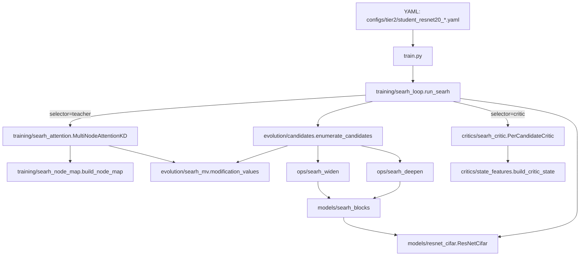

# CGSE codebase guide

**Purpose.** A **file-by-file** map of this repository so you can read it alongside the code and understand **what lives where**, **how data flows**, and **how pieces depend on each other**. This is the canonical “onboarding + deep dive” document for the implementation (complementary to `project-doc.pdf` for research narrative, `CGSE-implementation-log.md` for experiment history, and **[`CGSE-detailed-phase-walkthrough.md`](CGSE-detailed-phase-walkthrough.md)** for a long-form phase-by-phase story with rationale).

**How to maintain this document (important).**

- When you **add, rename, or delete** a module, script, or config: **update this guide in the same change** (or immediately after).  
- When you add a **new concept** (e.g. teacher, critic): add a short **architecture** subsection and new rows in the **file tables**.  
- Keep **entry points** (`train.py`, scripts) accurate so a reader can trace execution from top to bottom.

---

## Table of contents

1. [Big picture](#1-big-picture)
2. [Repository tree (top level)](#2-repository-tree-top-level)
3. [Execution paths](#3-execution-paths)
4. [Configs](#4-configs)
5. [Models](#5-models)
6. [Structural operations (`ops/`)](#6-structural-operations-ops)
7. [Training](#7-training)
8. [Utilities (`utils/`)](#8-utilities-utils)
9. [Scripts (`scripts/`)](#9-scripts-scripts)
10. [Tests & placeholders](#10-tests--placeholders)
11. [Generated & ignored artifacts](#11-generated--ignored-artifacts)
12. [Dependency graph (mental model)](#12-dependency-graph-mental-model)

---

## 1. Big picture

CGSE’s code is organized around three ideas:

1. **Mutable graph** — The student is a `torch.nn.Module` whose layers are stored in a **`ModuleDict`** with a fixed **execution order** (sequential forward). That makes “where to edit” explicit.
2. **Structural ops** — Small, testable functions (**widen**, **split/deepen**) that change width/depth while trying to **preserve behavior** (weight copy / identity init) and **fix downstream shapes**.
3. **Training loop** — Standard supervised learning; optionally **mutate** once or repeatedly, then **refresh the optimizer** so new parameters are trained.

Phase 2 adds **CIFAR-10** and **logging**. Phase 3 adds a **frozen teacher + KD** path (**SEArch-style control**). **CGSE** uses **`StructuralCritic`** (+ **`state_features`**) in **`train.py`** for mutation gating (no teacher); other multi-objective / hybrid ideas from early notes are **not** in scope for this repo.

**Planned backbone progression.** The current student in Phase 2 is a **small CIFAR CNN** (`CifarGraphNet`) because it is simple, fast, and makes mutation plumbing easy to validate. For paper-quality comparisons and later phases, the intended direction is to move the student backbone toward a **ResNet-style model** (still on CIFAR first), while keeping the same mutation/controller interfaces. When that switch happens, update this document’s **Models** and **Execution paths** sections accordingly.

---

## 2. Repository tree (top level)

```
cgse/
├── train.py                 # Main training CLI (legacy mutation/critic + searh.enabled branch)
├── requirements.txt         # Python deps (torch, torchvision, PyYAML)
├── configs/
│   ├── cifar/               # CIFAR YAML; `smoke/` = quick subset runs
│   ├── evolution/           # Tier 1b; `smoke/` = short dev runs
│   ├── tier2/               # Tier 2 (ResNet-20 / ResNet-56) incl. paper-faithful SEArch + CGSE-on-SEArch
│   └── synthetic/           # base.yaml (MLP smoke)
├── models/                  # GraphModule, StudentNet, CifarGraphNet, ResNetCifar, searh_blocks (sep-conv)
├── ops/                     # edge_widen, edge_split, resnet_*_widen, searh_deepen, searh_widen
├── evolution/               # SEArch / CGSE evolution machinery: candidates, MV scorer
├── training/                # Data loaders, train/eval loop, synthetic data, searh_loop, searh_attention, searh_node_map
├── utils/                   # checkpoint, seeds, validators, mutation logging, optimizer refresh
├── scripts/                 # Standalone mutation / robustness demos (not pytest); smoke_searh.py for end-to-end SEArch+CGSE check
├── critics/                 # StructuralCritic, DiscreteMutationCritic, PerCandidateCritic (SEArch loop)
├── paper_documentation/     # Paper PDFs, implementation log, this guide
├── runs/, runs_paper/       # tier1|tier1b|tier2|smoke × metrics|logs|mutations
├── checkpoints/             # Saved .pt (some patterns gitignored)
└── data/                    # Local datasets (gitignored)
```

---

## 3. Execution paths

### 3.1 Primary: CIFAR Phase 2 training

1. **`train.py`** loads YAML (`--config`, optional `--device` override).
2. **`training/data.build_cifar10_loaders`** builds train/test `DataLoader`s (optional subsets).
3. **`models/cifar_student.CifarGraphNet`** is constructed and moved to device; **`utils/graph_validator.validate_forward`** runs a tiny batch sanity check.
4. **Optimizer** (Adam by default) wraps `model.parameters()`.
5. Each **epoch**: **`training/loop.train_one_epoch`** → **`training/loop.evaluate`** (test set as “val”). If YAML **`teacher.enabled`**, training loss mixes CE with **KD** against a frozen **`CifarGraphNet`** loaded from **`teacher.checkpoint`**.
6. Optional **mutation**: YAML **`once_after_epoch`** (scheduled) **or** **`critic.enabled`** window + Bernoulli/ε-greedy gate → **`ops/edge_widen`**, **`refresh_optimizer`**, optional REINFORCE step on **`StructuralCritic`** (next-epoch Δval).
7. **Logging**: optional CSV (`training.log_csv`, includes **`critic_score`** when critic on), optional mutation JSONL (`mutation.log_jsonl`), console prints.
8. **Checkpoint**: **`save_checkpoint`** writes `checkpoints/<experiment.name>.pt`; critic weights → **`checkpoints/<experiment.name>_critic.pt`** when **`critic.enabled`**.

### 3.2 Legacy / smoke: synthetic MLP

If `model.name` is absent or not `cifar_cnn`, **`train.py`** uses **`models/student.StudentNet`** and **`training/synthetic.build_synthetic_loaders`** — random tensors, useful for quick pipeline checks (`configs/synthetic/base.yaml`).

### 3.3 Phase 1 validation scripts

Scripts under **`scripts/`** import **`models.graph.GraphModule`**, **`ops.edge_split`**, **`ops.edge_widen`**, **`utils.optimizer_utils.refresh_optimizer`**, etc., to test **preservation**, **live mutation**, **robustness** without full CIFAR training.

---

## 4. Configs

| File | Role |
|------|------|
| **`configs/synthetic/base.yaml`** | Phase-0 style: synthetic data, small MLP (`StudentNet`), `device`, few epochs. No `model.name` → MLP path in `train.py`. |
| **`configs/cifar/phase2_cifar.yaml`** | Default Phase 2: CIFAR subset, `CifarGraphNet`, `training.log_csv`, optional `mutation` (often off for baseline). |
| **`configs/cifar/phase2_cifar_full.yaml`** | Full 50k/10k CIFAR, more epochs — paper baseline runs. |
| **`configs/cifar/phase2_cifar_full_mutate.yaml`** | Same as full baseline + **one** `edge_widen` after epoch 10; separate CSV/JSONL/checkpoint name. |
| **`configs/cifar/phase2_cifar_full_cgse.yaml`** | Full CIFAR, **no teacher**; **`critic:`** gates one widen inside a window + REINFORCE. |
| **`configs/cifar/smoke/phase2_cifar_cgse_smoke.yaml`** | Small subset/epochs for fast CGSE smoke. |
| **`configs/cifar/smoke/phase2_smoke.yaml`** | Tiny subset, CPU-friendly smoke test. |
| **`configs/cifar/smoke/phase2_smoke_mutate.yaml`** | Smoke + one widen + mutation JSONL path. |
| **`configs/cifar/phase3_cifar_kd.yaml`** | Full CIFAR + **KD**: frozen teacher from `teacher.checkpoint` (same `CifarGraphNet` arch). |
| **`configs/cifar/smoke/phase3_cifar_kd_smoke.yaml`** | Small subset, few epochs, CPU; same teacher block. |
| **`configs/cifar/baseline_sear_ch_teacher_mutate.yaml`** | **SEArch control:** teacher + KD + one widen (same schedule as full mutate). |
| **`configs/evolution/evolution_tier1b_schedule.yaml`** | Tier 1b: fixed multi-op schedule, full CIFAR. |
| **`configs/evolution/evolution_tier1b_critic.yaml`** | Tier 1b: discrete critic over legal ops. |
| **`configs/evolution/smoke/evolution_tier1b_smoke.yaml`**, **`configs/evolution/smoke/evolution_tier1b_critic_smoke.yaml`** | Small subset / few epochs for pipeline checks. |
| **`configs/tier2/teacher_resnet56_cifar10.yaml`** | Tier 2 ResNet-56 teacher (used by KD and SEArch arms). |
| **`configs/tier2/student_resnet20_cifar10_*.yaml`** | Tier 2 student arms: `ce`, `kd`, `kd_budgeted`, `cgse_*` (legacy single-op CGSE). |
| **`configs/tier2/student_resnet20_cifar10_searh.yaml`** | **Paper-faithful SEArch:** channel-attention KD, MV-scored edge-splitting (deepen-first → widen), `B_op=7`, `param_budget_factor=1.5`, final retrain. Sets `searh.enabled: true`, `selector: teacher`. |
| **`configs/tier2/student_resnet20_cifar10_cgse_searh.yaml`** | **CGSE built on top of SEArch:** same outer loop, same operators, no teacher (zero teacher forwards), critic replaces MV scorer, high-frequency cadence (4 epochs/stage), `deepen_first: false`. Sets `searh.enabled: true`, `selector: critic`. |

**Cross-cutting YAML sections:**

- **`experiment.name`** — Used for checkpoint filename and run identity in logs.
- **`data`** — `root`, `num_workers`, `subset_train`, `subset_test` (see `training/data.py`).
- **`training`** — `epochs`, `batch_size`, `lr`, `weight_decay`, `seed`, `log_csv`.
- **`model`** — For CIFAR: `name: cifar_cnn`, `num_classes`. For MLP: `input_dim`, `hidden_dim`, `output_dim`.
- **`device`** — `cpu`, `cuda`, `mps`, or `auto` (overridable by CLI).
- **`teacher`** (Phase 3, CIFAR only) — `enabled`, `checkpoint`, `temperature`, `alpha` (KD weight on softened logits).
- **`mutation`** — `enabled`, `once_after_epoch`, `widen_delta`, `log_jsonl`.
- **`searh`** (Tier 2, ResNet only) — `enabled`, `selector` (`teacher` or `critic`), `epochs_per_stage`, `B_op`, `deepen_first`, `gamma`, `d_k`, `lambda_init`, `score_batches`, `param_budget_factor`, `final_retrain_epochs`. Critic-arm extras: `hidden_dim`, `critic_lr`, `epsilon`, `entropy_beta`, `max_epochs_hint`, `use_student_probe` (per-stage `act_var_ratio + grad_l2 + weight_delta` injected into local descriptor; CGSE-only), `baseline_momentum` (EMA momentum for the REINFORCE baseline subtracted from R; CGSE-only). When `searh.enabled`, `train.py` runs the unified `training.searh_loop.run_searh` and skips the legacy mutation/critic path.

---

## 5. Models

### 5.1 `models/graph.py`

**`GraphModule`** (`torch.nn.Module`):

- **`nodes`**: `nn.ModuleDict` — layer id → module.
- **`execution_order`**: list of ids — **forward** runs modules in this order.
- **`add_node`**, **`get_node`** — register and lookup.
- **`forward(x)`** — strictly sequential: each node receives the previous tensor output (supports Conv → … → Flatten → Linear chains).
- **`describe()`** — prints human-readable layer list (debugging).
- **`validate()`** — linear-chain dimension walk (legacy helper for MLP-heavy graphs; CNNs also work once execution hits the first `Linear`).
- **`widen_node(node_id, extra_out)`** — widen one `Linear` and resize downstream `Linear` layers (in-place mutation).
- **`insert_after(target_id, new_id, new_module)`** — deepen / insert (used by student deepen API).

**`Node`** — lightweight id + module holder (optional; core path uses `ModuleDict` directly).

### 5.2 `models/student.py`

**`StudentNet(GraphModule)`** — two-layer MLP: `linear1` → `relu1` → `linear2`.

- **`deepen_after(node_id)`** — insert **identity-initialized** `Linear(dim, dim)` after a `Linear` node (Net2Net-style deepen).

### 5.3 `models/cifar_student.py`

**`CifarGraphNet(GraphModule)`** — small **CNN** for CIFAR-10: several **Conv → BN → ReLU → Pool** blocks, **`Flatten`**, then **`fc1` → `relu_fc` → `fc2`**. Mutations in the current codebase typically target **`fc1`** (first `Linear` in order) when using `edge_widen` with auto target.

### 5.4 `models/resnet_cifar.py`

**`ResNetCifar`** — paper-faithful CIFAR-ResNet stack used by all Tier 2 arms. `depth=20` for the student, `depth=56` for the teacher. Stages `layer1` (16ch×32²), `layer2` (32ch×16²), `layer3` (64ch×8²), then global-pool + linear classifier. Each stage is `nn.Sequential` of `BasicBlock`s, which is exactly the surface the SEArch deepen/widen ops mutate.

### 5.5 `models/searh_blocks.py`

Building blocks for paper-faithful SEArch operators:

- **`SepConv3x3`** — depthwise 3x3 → BN → ReLU → pointwise 1x1 → BN (paper §3.5). `init_zero=True` zeroes the last BN γ so the module outputs 0 at init, used to make insertions function-preserving.
- **`DeepenBlock`** — residual wrapper around `SepConv3x3` with identity-init (`out = ReLU(x + SepConv(x))`, `SepConv(x)≡0` at init). Used by `ops/searh_deepen`.
- **`WidenedBlock`** — wraps an existing `BasicBlock` and adds one parallel residual sep-conv branch summed in (paper Fig 4b). Identity-init: branch outputs 0 at construction so the wrapped block's behaviour is preserved.

---

## 6. Structural operations (`ops/`)

| File | Role |
|------|------|
| **`ops/edge_widen.py`** | **`edge_widen(model, target_node_id=None, delta=...)`** — widen a `Linear`’s output by `delta`, copy existing weights into the top rows, then **resize every downstream `Linear`** to match new input width. Returns `model`. If `target_node_id` is `None`, picks the **first** `Linear` in `execution_order`. |
| **`ops/edge_split.py`** | **`edge_split(model, target_node_id=None)`** — insert an **identity** `Linear(in_f, in_f)` **before** the target linear in the order (deepen path). Forbids splitting the **last** layer (output). Fan-in **`in_f`** is the target linear’s **`in_features`** (correct after `Flatten` / conv stacks). |
| **`ops/resnet_layer3_widen.py`**, **`ops/resnet_head_widen.py`**, **`ops/resnet_insert_block.py`** | Tier 2 single-op mutations on `ResNetCifar`: widen layer3 channels, widen classifier head, insert one `BasicBlock` at the end of layer3. Function-preserving init via zero-fill of new weights. |
| **`ops/searh_deepen.py`** | **SEArch deepen** (paper §3.4): append one `DeepenBlock` (residual sep-conv 3x3, last BN γ zeroed → identity at insert) to `model.layer{stage}`. |
| **`ops/searh_widen.py`** | **SEArch widen** (paper §3.4 / Fig 4b): wrap the last legal `BasicBlock` (stride 1, in==out channels) with a `WidenedBlock` — original block + parallel sep-conv branch summed in (identity-init). |
| **`ops/__init__.py`** | Package marker (may be empty). |

**Invariant:** After these ops, **`utils/graph_validator.validate_graph`** (linear-only walk) or **`validate_forward`** (full forward) should be used depending on architecture.

---

## 6a. Evolution machinery (`evolution/`) — SEArch & CGSE-on-SEArch

| File | Role |
|------|------|
| **`evolution/candidates.py`** | **`Candidate(stage, op, node_id)`**, **`enumerate_candidates(model, b_op_cap, deepen_first)`** — produces the legal `(stage, op)` action set at the current architecture, with `B_op` cap on stacked deepens per stage and a stride/channel-safety filter (`_is_widenable_basic_block`) that excludes the stride-2 first block of stages 2 and 3. |
| **`evolution/searh_mv.py`** | **`compute_per_node_distances`** — averages `D(n)` over a few score batches (no-grad). **`modification_values`** — applies paper Eq. 5 (`MV(n) = D(n) · deg+/deg-`; for our linear ResNet stack deg± collapses to 1). **`rank_candidates`** — sorts candidates by MV descending. |

These modules are shared by both arms; the only difference is how MVs are produced (teacher attention KD vs. learned critic).

### What can the selector actually choose?

Both the teacher-MV selector (SEArch arm) and the critic-policy selector (CGSE arm) get the *exact same* candidate set:

| Op | Module | Effect | Function-preserving? | Reversible? |
|----|--------|--------|----------------------|-------------|
| `deepen` | `ops/searh_deepen.py` (`deepen_resnet_stage`) | Append one `DeepenBlock` (depthwise + pointwise sep-conv 3×3 with residual, identity-init) at the end of `model.layer{stage}` | Yes — last BN γ zeroed at init → block outputs 0 → wrapped by residual → identity | **No (currently)** |
| `widen` | `ops/searh_widen.py` (`widen_resnet_stage`) | Wrap the last stride-1 same-channel `BasicBlock` with a `WidenedBlock` (parallel sep-conv 3×3 branch summed in, identity-init) | Yes — branch's last BN γ zeroed → branch ≡ 0 → wrapped block's behaviour preserved | **No (currently)** |

**Both ops grow the network. There is no prune op, no noop, no cross-stage move.** The architecture grows monotonically until the candidate set is exhausted (each stage hit `B_op = 7` deepens AND every widenable block was wrapped) or the parameter budget is hit. This is by design — the SEArch paper's inventory is the same two operators (their Fig. 4a/4b), and we deliberately match it so that the comparison isolates the *signal* used to choose among candidates, not the *operators available*.

A possible extension — reversible mutations (`un_deepen`, `un_widen`) — is listed in [`SEArch-baseline-and-CGSE-evaluation-plan.md`](SEArch-baseline-and-CGSE-evaluation-plan.md) §3a as a "future work" item that would let the critic both grow and shrink. Not currently implemented.

## 7. Training

| File | Role |
|------|------|
| **`training/loop.py`** | **`train_one_epoch(..., teacher=None, kd_temperature, kd_alpha, kd_teacher_every_n_steps, kd_max_teacher_forwards)`** — CE, or \((1-\alpha)\) CE + \(\alpha\) KD vs frozen teacher; supports **budgeted KD** (skip teacher forwards by step cadence and/or absolute cap). **`evaluate`** — CE + accuracy (student only). |
| **`training/data.py`** | **`build_cifar10_loaders(cfg)`** — torchvision **CIFAR-10**, train augment, test eval transform, optional **`Subset`**. |
| **`training/synthetic.py`** | **`build_synthetic_loaders(cfg)`** — `TensorDataset` of random features/labels for MLP smoke tests. |
| **`training/searh_attention.py`** | **`ChannelAttentionKD`** (paper Eqs. 1–3): per-channel descriptor → softmax attention over teacher channels → projected feature → squared L2. **`MultiNodeAttentionKD`** wraps several heads with forward hooks on stage outputs (lazy head-build, optimizer-friendly). |
| **`training/searh_node_map.py`** | **`build_node_map`** — pairs student/teacher stage outputs (`stage1`/`stage2`/`stage3`); spatial and channel widths match exactly between ResNet-20 and ResNet-56 at these points. |
| **`training/searh_loop.py`** | **`run_searh`** — unified outer loop (paper Algorithm 1) used by both arms. Trains a stage with cosine λ-anneal (Eq. 4) when `selector=teacher`, plain CE when `selector=critic`; at every stage end enumerates legal candidates, computes MV per candidate, applies the chosen edit, refreshes the optimizer, and (CGSE) runs a REINFORCE update with entropy bonus. Terminates at `param_budget_factor × initial_params`; runs an optional final retrain phase. |

---

## 7a. Critics (`critics/`) — CGSE policies

| File | Role |
|------|------|
| **`critics/critic.py`** | **`StructuralCritic`** — single-output MLP; outputs a real-valued logit for the legacy "should I widen now?" gate (Tier 1, Tier 2 single-op CGSE arms). |
| **`critics/discrete_critic.py`** | **`DiscreteMutationCritic`** — softmax over a fixed action list (`noop`, `widen_*`, `head_widen`, …) used by Tier 1b and Tier 2 multi-op CGSE arms before SEArch landed. |
| **`critics/searh_critic.py`** | **`PerCandidateCritic`** — the new CGSE-on-SEArch policy. Takes a single tensor `(K, state_dim + local_dim)` where each row is one candidate's `(global_state ⊕ local_descriptor)`; outputs `(K, 1)` scalar scores. Argmax (with ε-greedy exploration) selects the next `(stage, op)` edit; trained by REINFORCE on `advantage = R − baseline` (EMA baseline) with an entropy bonus. `local_dim` is `5 + PROBE_DIM` when the student probe is enabled, else 5. |
| **`critics/state_features.py`** | **`STATE_DIM=8`**, **`build_critic_state(...)`** — packs train/val losses, accuracies, epoch progress, param scale, and deltas into a fixed-shape state vector. Shared by all critic flavours. |
| **`critics/student_probe.py`** | **`StudentProbe`** — per-stage telemetry for CGSE: `act_var_ratio` (unsupervised analogue of SEArch's `D(n)`, computed via power-iteration on the channel covariance), `grad_l2` (per-stage gradient norm from the last backward), `weight_delta` (Frobenius distance from the last per-stage mutation snapshot). `PROBE_DIM = 3` exported. Lifecycle: `attach` once → `update_grads`/`run_forward`/`per_stage_features` once per stage end → `snapshot_stage` after each mutation → `detach` at run end. |

## 8. Utilities (`utils/`)

| File | Role |
|------|------|
| **`utils/checkpoint.py`** | **`save_checkpoint`**, **`load_model_weights`** (restore `model` from a file saved by `save_checkpoint`). |
| **`utils/repro.py`** | **`set_seed(seed)`** — Python / NumPy / PyTorch seeds. |
| **`utils/graph_validator.py`** | **`validate_graph(model, input_dim=...)`** — walks `Linear` layers in order (legacy MLP checks). **`validate_forward(model, x)`** — one forward pass (good for CNNs). |
| **`utils/optimizer_utils.py`** | **`refresh_optimizer(old_opt, model)`** — new optimizer over `model.parameters()`, copies optimizer state for **tensor-identical** parameters, fresh state for new tensors. |
| **`utils/model_info.py`** | **`count_trainable_parameters`**, **`first_linear_node_id`**, **`linear_layer_shapes`** — introspection for logging and mutation targeting. |
| **`utils/mutation_log.py`** | **`append_mutation_jsonl(path, dict)`** — append one JSON object per line (mutation events). |
| **`utils/run_paths.py`** | **`normalize_run_artifact_path`** — redirects legacy `paper_documentation/runs/...` strings in config to `runs/...` (warns). |
| **`paper_documentation/runs`** | **Sentinel file** (not a directory). Prevents accidental creation of `paper_documentation/runs/` as a folder; see file contents. |

---

## 9. Scripts (`scripts/`)

Runnable demos / stress tests (invoke with `python scripts/<name>.py` from repo root or with `sys.path` hacks as in each file):

| Script | Purpose |
|--------|---------|
| **`validate_mutation.py`** | Forward/backward before/after split + widen; uses **`validate_graph`**. |
| **`test_preservation.py`** | Compare outputs before/after **`edge_split`** (expect ~0 diff for identity insert). |
| **`test_live_mutation.py`** | Train a few steps, mutate, refresh optimizer, train again. |
| **`test_robustness.py`** | Random sequences of split/widen + **`refresh_optimizer`**; deterministic replay check. |
| **`test_graph_visual.py`**, **`test_graph_ascii.py`** | Visual / ASCII printouts of graph structure after mutations (human inspection). |

---

## 10. Tests & placeholders

| Path | Status |
|------|--------|
| **`tests/test_graph_ops.py`** | **Pytest:** KD formula, checkpoint round-trip, **`edge_widen` / `edge_split`**, teacher+KD smoke, critic state (`pytest tests/test_graph_ops.py`). |

---

## 11. Generated & ignored artifacts

| Path | Notes |
|------|------|
| **`data/`** | CIFAR download cache — **gitignored** (see root `.gitignore`). |
| **`checkpoints/`** | Training outputs; **`checkpoints/cgse_*.pt`** pattern gitignored; older **`phase0.pt`** may still be tracked from earlier commits. |
| **`runs/`** (repo root) | **`metrics/`**, **`logs/`**, **`mutations/`**; top-level **symlinks** keep legacy paths working. See **`runs/README.md`**. |
| **`__pycache__/`, `.ipynb_checkpoints/`** | Should not be committed — in `.gitignore`. |

---

## 12. Dependency graph (mental model)

### Legacy path (Phase 1–4)

```mermaid
flowchart TD
  subgraph configs [YAML under configs/]
    Y[YAML]
  end
  train[train.py]
  data[training/data.py / synthetic.py]
  loop[training/loop.py]
  cifar[models/cifar_student.py]
  student[models/student.py]
  graph[models/graph.py]
  ops[ops/edge_widen.py / edge_split.py]
  optu[utils/optimizer_utils.py]
  log[utils/mutation_log.py / model_info.py]
  ckpt[utils/checkpoint.py]

  Y --> train
  train --> data
  train --> cifar
  train --> student
  cifar --> graph
  student --> graph
  train --> loop
  train --> ops
  ops --> graph
  train --> optu
  train --> log
  train --> ckpt
```

**Rule of thumb:** **`models/graph.py`** + **`ops/*`** define *what can change*; **`training/*`** + **`train.py`** define *how we learn*; **`utils/*`** define *reproducibility and observability*.

### Tier 2 SEArch & CGSE-on-SEArch path



**The substitution.** Both selectors feed the same `(stage, op)` candidate set into the same `searh_deepen` / `searh_widen` operators. Only the *signal* differs — teacher channel-attention KD distance vs. learned critic policy.

**Planned (Tier 1b).** Multi-stage training, **param/FLOP budget**, **multiple** mutations, **discrete (site × operator)** critic — spec and checklist in **[`SEArch-baseline-and-CGSE-evaluation-plan.md`](SEArch-baseline-and-CGSE-evaluation-plan.md) §7**. Update this guide when `train.py` gains stage loops and new ops.

---

## Document history

| Date | Change |
|------|--------|
| 2026-04-02 | Initial guide: Phase 1–2 layout, configs, scripts, placeholders. |
| 2026-04-02 | **`runs/`** at **repo root** only; legacy YAML paths rewritten in code. |
| 2026-04-02 | **`paper_documentation/runs`** is a **sentinel file** blocking a duplicate `runs/` directory under docs. |
| 2026-04-04 | Cross-link **[`CGSE-detailed-phase-walkthrough.md`](CGSE-detailed-phase-walkthrough.md)** from the purpose blurb (narrative + rationale companion). |
| 2026-04-04 | Phase 3: **`teacher`** YAML, KD in **`training/loop.py`**, **`load_model_weights`**, configs **`phase3_cifar_kd*.yaml`**. |
| 2026-04-04 | Scope: **teacher vs critic** only; **`baseline_sear_ch_teacher_mutate.yaml`**, **`StructuralCritic`** in **`critics/`**. |
| 2026-04-04 | **Tier 1b** roadmap: pointer to **[`SEArch-baseline-and-CGSE-evaluation-plan.md`](SEArch-baseline-and-CGSE-evaluation-plan.md) §7** (multi-stage, multi-op, critic v2). |
| 2026-04-28 | **Tier 2 SEArch & CGSE-on-SEArch.** Added `models/searh_blocks.py`, `training/searh_attention.py`, `training/searh_node_map.py`, `training/searh_loop.py`, `evolution/{candidates,searh_mv}.py`, `ops/searh_{deepen,widen}.py`, `critics/searh_critic.py`. Two new configs (`student_resnet20_cifar10_searh.yaml`, `…_cgse_searh.yaml`) — same outer loop, only the MV-scoring signal swaps (teacher channel-attention KD ↔ critic policy). New `searh:` YAML section documented in §4. |
| 2026-04-28 | **CGSE student probe + REINFORCE baseline.** Added `critics/student_probe.py` (`StudentProbe`: `act_var_ratio`, `grad_l2`, `weight_delta` per stage). `training/searh_loop.run_searh` gained probe lifecycle, per-stage telemetry collection, EMA-baseline-subtracted REINFORCE. CGSE config defaults to `use_student_probe: true`, `baseline_momentum: 0.9`. |

*Append a row whenever this guide is meaningfully updated.*
