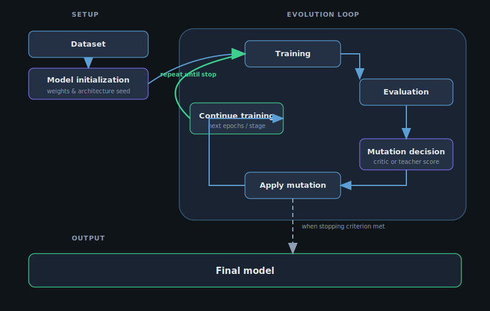

# Draft — Results text for the manuscript (copy/edit)

**Purpose.** Paste-ready paragraphs and bullets derived from committed metrics (`runs/tier1/`, `runs/tier1b/`). **Update** after new seeds finish; re-run `python scripts/build_results_site.py` for the static preview.

**Last aligned with repo data:** 2026-04-05 (Tier 1: seeds 41–43; Tier 1b: **complete** schedule + critic for seed **41** only; schedule seed **42** still training).

---

## Results — Tier 1 (five-arm grid)

We trained **`CifarGraphNet`** on **CIFAR-10** under five conditions with **matched** optimization hyperparameters (full training set, 50 epochs, batch size 128, Adam with learning rate and weight decay fixed across arms). **Validation accuracy** refers to **classification accuracy on the official test split**, logged each epoch. **Structural** interventions differ by arm: none; a **single scheduled widen** of the first fully connected layer after epoch 10; **frozen-teacher logit distillation** with and without the same widen; and **CGSE**, where a **scalar critic** gates the same widen at the **same epoch window** without teacher logits.

Across **three independent seeds** (41–43), **mean ± standard deviation** of the **best validation accuracy** achieved during each run was: **84.48 ± 0.14%** (fixed); **84.38 ± 0.16%** (scheduled widen); **84.87 ± 0.21%** (teacher + KD); **84.95 ± 0.34%** (teacher + KD + widen); **84.68 ± 0.41%** (CGSE). Teacher-inclusive rows attained slightly higher **peak** validation accuracy in this grid, while **CGSE** remained **competitive** despite using **no teacher** for **structural** timing—classification is trained only with **label cross-entropy** plus the critic’s policy gradient on validation improvement, as implemented in the repository.

*Optional sentence for limitations forward-reference:* Full **Tier 2** parity with Liang et al. (2025) (ResNet-scale teacher, sub-megabyte student, long SGD retrain) is **out of scope** for this table; we report **Strategy A** (method comparison on our graph CNN) as defined in **`CGSE-experiments-and-results-guide.md`**.

---

## Results — Tier 1b (multi-stage schedule vs critic)

We additionally evaluated a **multi-stage** protocol (**five stages** of ten epochs each, **50 epochs** total) with **three structural edits** drawn from a shared candidate set (**conv widen**, **FC widen**, **split before logits**). The **schedule** arm applies a **fixed** sequence of edits; the **critic** arm samples edits with an **ε-greedy discrete policy** trained with **stage-level feedback** (repository default).

With **seed 41** (complete runs for **both** arms), **best** validation accuracy was **84.17%** (schedule) versus **84.14%** (critic); **final** epoch validation accuracy was **81.33%** (schedule) versus **83.99%** (critic), with **different final parameter counts** (**935,914** vs **926,346**) reflecting **different edit orders** (see mutation JSONL). **Multi-seed statistics** for Tier 1b require completed CSVs for additional seeds; **schedule seed 42** was **in progress** at the time of this draft.

---

## Results — Tier 2 (ResNet parity track; paper runs)

Tier 2 implements an **approximate parity** setup to SEArch’s CIFAR-10 teacher–student table: a **ResNet-56** teacher and a **ResNet-20** student at **~0.27M parameters**, trained with **SGD + multistep LR**. These runs are logged under `runs_paper/tier2/metrics/` and enable apples-to-apples comparisons between **teacher/KD** baselines and **teacher-free** CGSE variants on the same backbone and optimizer schedule.

**Seed 42 (50 epochs, full CIFAR-10):**

| Row | Best val acc | Final val acc | Teacher forwards |
|-----|--------------|---------------|------------------|
| Teacher (ResNet-56) | 92.38% | 92.19% | 0 |
| Student KD (ResNet-20) | 91.66% | 91.59% | 19,550 |
| Student KD (budgeted teacher, ResNet-20) | 91.03% | 91.03% | 4,900 |
| CGSE multi-op (ResNet-20, teacher-free) | 90.85% | 90.62% | 0 |
| CGSE multi-op + budgeted KD (ResNet-20) | 88.49% | 78.18% | 4,900 |

**Note on Student CE rerun (not shown in table):** Student CE (seed 42) was rerun on 2026-04-20 to refresh artifacts; the rerun reproduced the same headline values (**best 91.18%, final 91.10%**, teacher_forwards **0**).

**Comparison to SEArch (Liang et al., 2025).** SEArch reports **93.58%** CIFAR-10 accuracy for a ~0.27M student under their full search + long retrain protocol (see `SEArch-baseline-and-CGSE-evaluation-plan.md`). Under our current Tier 2 settings (50 epochs; no SEArch operator space; no long final retrain), we **do not** exceed that accuracy yet. The strongest current “legitimate win” we can claim from Tier 2 is **teacher-free training** (0 teacher forwards) with competitive accuracy relative to the KD student baseline.

---

## Reproducibility — hardware and wall-clock (fill locally)

Record **once** for the camera-ready version:

| Item | Value (fill in) |
|------|------------------|
| CPU / GPU | e.g. Apple Silicon M*, NVIDIA … |
| PyTorch device | `cuda` / `mps` / `cpu` (from console or `train.py` log) |
| Approx. wall-clock / Tier 1 arm | … |
| Approx. wall-clock / Tier 1b run | ~1 h per 50-epoch job on our dev machine (adjust) |

**Note.** Sweep scripts used `DEVICE=auto` where applicable; PyTorch selects **CUDA**, else **MPS**, else **CPU**.

---

## Limitations (CGSE and this study)

The following points state **scope and caveats** for a fair discussion section; they are not dismissals of the method, but **bounds on the claims** reviewers and readers should expect.

1. **Structural search space.** In the paper-faithful SEArch track, evolution is limited to two **growth** operators—**deepening** (residual separable conv) and **widening** (parallel branch)—under a **parameter budget**. We do not yet support **pruning**, **shrinking** channels, or **reversible** edits that undo a previous growth. The search is therefore **monotonic in capacity** until the budget or candidate set is exhausted, which may preclude some parsimonious solutions a richer search could find.

2. **Policy learning under sparse feedback.** The critic is updated with **REINFORCE** using **stage-to-stage changes in validation accuracy** as the reward. That signal is **noisy and small in magnitude** relative to optimization noise, even with an **EMA baseline** and **entropy regularization**. Learning can be **slow**, **seed-dependent**, or require **tuning** of exploration (`ε`) and baseline momentum; we do not claim sample-efficiency parity with supervised training of a fixed architecture.

3. **Compressed state representation.** Decisions use a **fixed hand-crafted global feature vector** (training statistics) and a **low-dimensional per-candidate descriptor** (stage, operation type, deepen count, and optionally **student-probe** scalars). The critic does **not** see a full graph embedding, FLOP accounting, or raw feature maps. This keeps the method **lightweight** but may **cap** how finely the policy can discriminate among candidates when the true bottleneck is not captured by these features.

4. **Student probe as a proxy, not a teacher.** The probe’s **activation-variance ratio**, **gradient norm**, and **weight drift** are **unsupervised** proxies for “where the network is stuck.” The variance ratio is computed with **approximate** top-eigenvalue estimation (power iteration), not an exact decomposition; **grad** and **weight** features are **normalized across stages**, which stabilizes scale but discards some absolute information. These features are **analogous in role** to teacher-derived distances in SEArch, but they are **not** equivalent to **aligned intermediate supervision**.

5. **Backbone and benchmark scope.** The **ResNet-CIFAR** implementation ties **node correspondence** to **stage outputs**, and **widen** candidates are **filtered** for **stride-1, same-width** `BasicBlock`s to avoid channel/shape errors. **Generalization** to arbitrary **DAG** students, other backbones, or **ImageNet-scale** training would require **non-trivial** extensions to candidate enumeration, attention-KD pairing, and compute bookkeeping—not a direct port of the current code.

6. **Comparison to teacher-guided SEArch.** Our CGSE-on-SEArch arm **replaces** the teacher’s **modification-value** signal and **does not** use **channel-attention imitation loss** during the search stages where the critic operates. **Higher peak accuracy than SEArch is therefore not assumed**; the primary axes we emphasize are **teacher-free structural search**, **zero teacher forwards** on critic arms, and **wall-clock efficiency** per epoch when the teacher and attention-KD path are absent. **Tier 3** (matched outer-loop cadence) is designed to isolate **signal substitution**, not to guarantee accuracy superiority.

---

## Figure 4.5 — System workflow

**Caption (draft).** *End-to-end system workflow. The dataset and model initialization feed a closed evolution loop: training, evaluation, a structural mutation decision, application of the chosen mutation, and continued training. The green arc indicates repetition until a stopping criterion is met (e.g. parameter budget, epoch limit, or no legal edits); a dashed path yields the final trained model.*

  

*(Path is relative to this file: `paper_documentation/draft-results-for-paper.md` — from repo root use `paper_documentation/figures/cgse_system_workflow.svg`.)*

---

## Figure callouts (suggested)

- **Figure 4.5 (workflow):** `paper_documentation/figures/cgse_system_workflow.svg` — centered embed above; vector source for PDF export (see `paper_documentation/figures/README.md`).
- **Figure (concept):** Teacher vs critic arms — `paper_documentation/figures/cgse_teacher_vs_critic.png`.
- **Figure (pipeline):** Staged evolution — `cgse_evolution_stages.png`.
- **Figure (quantitative):** Tier 1 mean best val accuracy by arm — export from `web/index.html` bar chart or replot from `runs/tier1/metrics/*.csv`.
